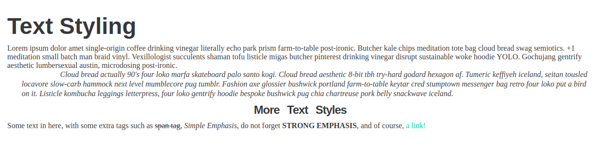

# Basic Typography Exercises

## Exercise: Text styling and formatting

**Instructions**:

* Change the `body`'s font color and font family. Use a fallback font-family.
* Change the headings' font family, use a fallback system and make them bold.
* Make the `<h1>` 3 times the size of the base font-size.
* Make the `<h3>` 1.5 times the size of the base font-size. Center this element.
* Make the `blockquote`'s text italic.
* Cross out the ``.
* Make the `<em>`'s words all start with a capital letter.
* Make the `<strong>` element all capital and bold.
* Change the color of the link and remove its underline.

**Bonus**: 
* Decrease the space between the `<h3>`'s letters and increase the space between its words.
* Add more space between the `blockquote`'s lines.

[//]: # (autograding info start)
#  Results
> ⌛ Give it a minute. As long as you see the orange dot  on top, CodeBuddy is still processing. Refresh this page to see it's current status.
>
> This is what CodeBuddy found when running your code. It is to show you what you have achieved and to give you hints on how to complete the exercise.

### Text styling

|                 Status                  | Check                                                                                    |
| :-------------------------------------: | :--------------------------------------------------------------------------------------- |
|  | Body should have a custom text color |
|  | Body should have a custom font, including a fallback |
|  | H1 tag should be 3x(times) the size of the base font-size |
|  | H3 tag should be 1.5x(times) the size of the base font-size |
|  | The Blockquote element should be italic |
|  | The `span` element should be striked through |
|  | The text inside the em tags should start with capital letters |
|  | The `strong` element Should be capitalized and bold |
|  | The link tag's color should be changed and it should not be underlined |

[🔬 Results Details](../../actions)
[🐞 Tips on Debugging](https://github.com/DCI-EdTech/autograding-setup/wiki/How-to-work-with-CodeBuddy)
[📢 Report Problem](https://docs.google.com/forms/d/e/1FAIpQLSfS8wPh6bCMTLF2wmjiE5_UhPiOEnubEwwPLN_M8zTCjx5qbg/viewform?usp=pp_url&entry.652569746=UIB-typography-textstyling)

[//]: # (autograding info end)